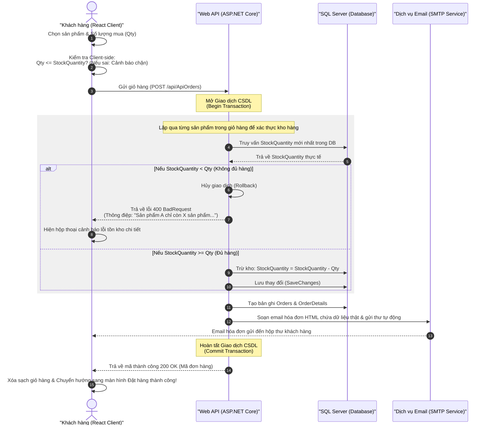

# VuCMS - Hệ thống Quản trị Nội dung và Bán hàng Thiết bị Võ thuật

VuCMS là dự án đồ án tốt nghiệp thiết kế theo mô hình **Headless CMS & E-commerce** chuyên dụng cho cửa hàng bán võ phục, đai võ và thiết bị bảo hộ Karatedo. Hệ thống được xây dựng tách biệt hoàn toàn giữa Backend Web API và Frontend Single Page Application (SPA).

---

## 1. Cấu trúc Thư mục Dự án

Dự án được tổ chức thành cấu trúc thư mục rõ ràng theo mô hình Decoupled Architecture:

```text
VuCMS_Solution/
├── VuCMS_Solution.sln          # File Solution chính quản lý các dự án .NET
│
├── CMS.Data/                   # Dự án Class Library - Quản lý Cơ sở dữ liệu & Entity
│   ├── Entities/               # Định nghĩa các thực thể CSDL (Product, Customer, Order, Post...)
│   │   ├── Category.cs
│   │   ├── CategoryProduct.cs
│   │   ├── Customer.cs
│   │   ├── Order.cs
│   │   ├── OrderDetail.cs
│   │   ├── Post.cs
│   │   ├── Product.cs
│   │   └── User.cs
│   └── ApplicationDbContext.cs # Khai báo DbContext của Entity Framework Core
│
├── CMS.Backend/                # Dự án Web API & MVC Admin - Tầng xử lý nghiệp vụ Server
│   ├── Controllers/            # Chứa các Controller xử lý Request
│   │   ├── MVC Admin/          # Quản trị dữ liệu MVC (PostController, ProductController...)
│   │   └── API/                # API cấp dữ liệu cho Frontend (ApiCustomersController, ApiOrdersController...)
│   ├── Models/                 # DTOs và cấu hình mapping (EmailSettings.cs...)
│   ├── Services/               # Chứa dịch vụ gửi mail (EmailService.cs...)
│   ├── Views/                  # Giao diện Razor View quản trị dành cho Admin & Editor
│   ├── wwwroot/                # Thư mục tài nguyên tĩnh (Css, Js và ảnh tải lên /images/)
│   ├── appsettings.json        # File cấu hình ứng dụng (Chuỗi kết nối DB, cấu hình SMTP Gmail)
│   └── Program.cs              # File khởi tạo dịch vụ Dependency Injection & Routing
│
└── cms.frontend/               # Dự án ReactJS - Giao diện người dùng Single Page Application (SPA)
    ├── public/                 # Các tài nguyên tĩnh công khai phía Client
    └── src/
        ├── api/                # Cấu hình API Client dùng chung (axiosClient.js)
        ├── components/         # Các Component giao diện tái sử dụng (ProductCard, Footer, Header...)
        ├── pages/              # Các trang chức năng chính của ứng dụng
        │   ├── Home.jsx        # Trang chủ hiển thị tin tức, sản phẩm bán chạy, sản phẩm mới
        │   ├── Shop.jsx        # Trang cửa hàng lọc sản phẩm
        │   ├── Cart.jsx        # Trang giỏ hàng, điền thông tin và đặt hàng
        │   ├── Login.jsx       # Trang đăng nhập tài khoản khách hàng
        │   ├── Register.jsx    # Trang đăng ký có xác thực email trùng lặp
        │   ├── Profile.jsx     # Trang cá nhân cập nhật thông tin và đổi mật khẩu
        │   ├── Orders.jsx      # Trang lịch sử đơn hàng đã mua
        │   └── ForgotPassword.jsx # Trang khôi phục mật khẩu qua Email
        ├── services/           # Các dịch vụ gọi API (customerService.js, orderService.js...)
        ├── App.js              # Điểm khởi đầu cấu hình Route chính của ứng dụng
        └── index.js            # Render React App vào DOM
```

---

## 2. Chi tiết Cấu trúc các Bảng dữ liệu (Database Schema)

Hệ thống được chuẩn hóa dữ liệu quan hệ chặt chẽ và ghi xuống SQL Server bao gồm các bảng:

### 2.1. Bảng Khách hàng (`Customers`)
*   `Id` (int, Khóa chính, Tự tăng): Mã định danh duy nhất của khách hàng.
*   `FullName` (nvarchar, Bắt buộc): Họ và tên khách hàng.
*   `Email` (nvarchar, Bắt buộc, Unique Index): Email tài khoản, dùng để đăng nhập và nhận hóa đơn.
*   `Phone` (nvarchar, Cho phép null): Số điện thoại liên hệ.
*   `Address` (nvarchar, Cho phép null): Địa chỉ giao hàng mặc định.
*   `PasswordHash` (nvarchar, Bắt buộc): Mật khẩu đã được mã hóa an toàn bằng thuật toán **BCrypt**.

### 2.2. Bảng Sản phẩm (`Products`)
*   `Id` (int, Khóa chính, Tự tăng): Mã sản phẩm.
*   `Name` (nvarchar, Bắt buộc): Tên võ phục / dụng cụ bảo hộ.
*   `Description` (nvarchar, Cho phép null): Mô tả chi tiết.
*   `Price` (decimal(18,2), Bắt buộc): Giá bán sản phẩm.
*   `ImageUrl` (nvarchar, Cho phép null): Đường dẫn hình ảnh đại diện.
*   `StockQuantity` (int, Bắt buộc): Số lượng tồn kho hiện tại phục vụ bán hàng.
*   `CategoryProductId` (int, Khóa ngoại): Liên kết đến bảng danh mục sản phẩm.

### 2.3. Bảng Đơn hàng (`Orders`)
*   `Id` (int, Khóa chính, Tự tăng): Mã đơn hàng.
*   `CustomerId` (int, Khóa ngoại): Khách hàng thực hiện đơn đặt.
*   `OrderDate` (datetime2, Bắt buộc): Thời gian đặt hàng.
*   `Notes` (nvarchar, Cho phép null): Ghi chú giao nhận của khách.
*   `Status` (int, Bắt buộc): Trạng thái đơn (Chờ xử lý, Đang giao, Đã giao, Đã hủy).

### 2.4. Bảng Chi tiết Đơn hàng (`OrderDetails`)
*   `Id` (int, Khóa chính, Tự tăng): Định danh dòng chi tiết.
*   `OrderId` (int, Khóa ngoại): Thuộc về đơn hàng nào.
*   `ProductId` (int, Khóa ngoại): Mã sản phẩm được mua.
*   `Quantity` (int, Bắt buộc): Số lượng mua của sản phẩm đó.
*   `UnitPrice` (decimal(18,2), Bắt buộc): Giá của sản phẩm tại thời điểm mua hàng.

### 2.5. Bảng Bài viết Tin tức (`Posts`)
*   `Id` (int, Khóa chính, Tự tăng): Mã bài viết.
*   `Title` (nvarchar, Bắt buộc): Tiêu đề tin tức.
*   `Content` (nvarchar(max), Bắt buộc): Nội dung bài viết dạng HTML (từ CKEditor).
*   `ImageUrl` (nvarchar, Cho phép null): Ảnh bìa bài viết.
*   `CreatedDate` (datetime2, Bắt buộc): Ngày đăng.
*   `CategoryId` (int, Khóa ngoại): Chuyên mục bài viết.

---

## 3. Luồng Nghiệp vụ Đặt hàng & Xử lý Tồn kho (Stock Checking Flow)

Luồng nghiệp vụ mua hàng và kiểm tra kho hàng thực tế được thiết kế bảo vệ 2 lớp (Double-Gate Validation) để ngăn chặn tình trạng bán quá số lượng tồn kho (`StockQuantity`).



---

## 4. Danh sách các API Endpoints Phát triển

### 4.1. Khách hàng (`ApiCustomersController`)
*   `POST /api/ApiCustomers/register`: Đăng ký tài khoản khách hàng mới.
*   `POST /api/ApiCustomers/login`: Đăng nhập, xác thực và trả về thông tin hồ sơ.
*   `GET /api/ApiCustomers/check-email?email={email}`: Kiểm tra trùng lặp email thời gian thực khi đăng ký.
*   `POST /api/ApiCustomers/forgot-password`: Khôi phục mật khẩu tạm thời ngẫu nhiên và gửi về email qua SMTP.
*   `PUT /api/ApiCustomers/update`: Cập nhật hồ sơ khách hàng.

### 4.2. Đơn hàng (`ApiOrdersController`)
*   `POST /api/ApiOrders`: Đặt hàng. Tích hợp Database Transaction kiểm tra tồn kho và tự động gửi email hóa đơn.
*   `GET /api/ApiOrders/customer/{customerId}`: Lấy danh sách đơn hàng đã mua.

### 4.3. Sản phẩm (`ApiProductsController`)
*   `GET /api/ApiProducts`: Lấy toàn bộ danh sách sản phẩm.
*   `GET /api/ApiProducts/{id}`: Lấy chi tiết sản phẩm.
*   `GET /api/ApiProducts/latest`: Lấy danh sách sản phẩm mới nhập.
*   `GET /api/ApiProducts/best-selling`: Lấy top sản phẩm bán chạy nhất dựa trên hóa đơn.

### 4.4. Bài viết (`ApiPostsController`)
*   `GET /api/ApiPosts`: Lấy danh sách tất cả bài viết.
*   `GET /api/ApiPosts/{id}`: Lấy chi tiết bài viết.
*   `GET /api/ApiPosts/latest`: Lấy top 3 bài viết mới nhất cho trang chủ.
*   `POST /api/upload-image`: Upload hình ảnh CKEditor 5 lên Backend.

---

## 5. Hướng dẫn Cấu hình và Chạy Dự án

### 5.1. Cấu hình Backend (`CMS.Backend`)
1.  Mở file appsettings.json.
2.  Cập nhật chuỗi kết nối cơ sở dữ liệu SQL Server tại mục `ConnectionStrings:DefaultConnection`.
3.  Cấu hình tài khoản gửi Email (SMTP Settings) tại block `EmailSettings`:
    ```json
    "EmailSettings": {
      "SmtpServer": "smtp.gmail.com",
      "SmtpPort": 587,
      "SenderEmail": "vutranit04@gmail.com",
      "SenderName": "VuCMS Store",
      "Username": "vutranit04@gmail.com",
      "Password": "yisb jcey dhbq iufv"
    }
    ```
4.  Để chạy Backend, truy cập thư mục `CMS.Backend` và chạy lệnh sau trong PowerShell hoặc Terminal:
    ```bash
    dotnet run --launch-profile https
    ```
    *API Swagger UI sẽ khả dụng tại đường dẫn: `https://localhost:7298/swagger`.*

### 5.2. Cấu hình Frontend (`cms.frontend`)
1.  Truy cập thư mục `cms.frontend`.
2.  Đảm bảo file cấu hình kết nối API ở axiosClient.js khớp với cổng chạy thực tế của Backend:
    ```javascript
    const API_BASE_URL = 'https://localhost:7298/api';
    const IMAGE_BASE_URL = 'https://localhost:7298';
    ```
3.  Cài đặt các gói phụ thuộc và chạy ứng dụng:
    ```bash
    npm install
    npm start
    ```
    *Giao diện người dùng sẽ mở tại địa chỉ: `http://localhost:3000`*

---

## 6. Bản quyền & Thông tin Sinh viên
*   **Họ và tên**: Trần Minh Vũ
*   **MSSV**: 2122110359
*   **Lớp**: Công nghệ thông tin
*   **Phiên bản**: 1.0.0
